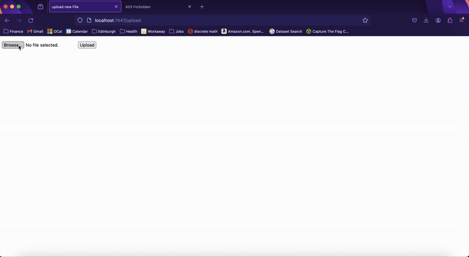

# Flask on Docker (Creating a Simple Web App)
Included in this repo is information to dockerize Flask with Postgres, Gunicorn, and Nginx. A comprehensive tutorial can be found [here](https://testdriven.io/blog/dockerizing-flask-with-postgres-gunicorn-and-nginx/).     

## Overview
Using a modified Instagram tech stack, dockerizing Flask allows us to get a fully working web service. This was done by creating necessary files for a simple web app. To do this, Flask was configured to run on Docker with Postgres. Nginx and Gunicorn were added for production environments and serving static and user-uploaded media files (via Nginx). The web service follows a microservices architecture, with Docker containers encapsulating different components. Requests flow through Nginx, which acts as a reverse proxy, forwarding requests to Gunicorn for processing Flask application logic. This setup enables users to test a production environment locally and ensures effective handling of static and media files. We can see an example of locally uploading and viewing a user-uploaded media file here:

